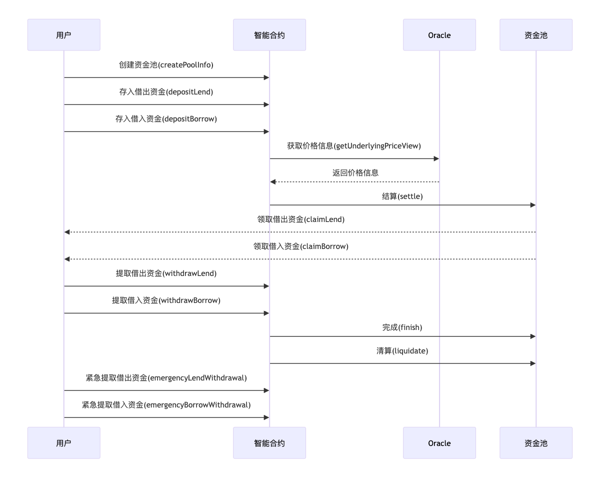

Pledge 是一个去中心化金融（DeFi）项目，旨在提供固定利率的借贷协议，主要服务于加密资产持有者。以下是对 Pledge 项目的详细分析：

### 项目背景

Pledge 旨在解决 DeFi 借贷市场中缺乏固定利率和固定期限融资产品的问题。传统的 DeFi 借贷协议通常采用可变利率，主要服务于短期交易者，而 Pledge 则专注于长期融资需求。

### 核心功能

1. **固定利率借贷**：Pledge 提供固定利率的借贷服务，减少利率波动带来的风险。
2. **去中心化 Dex 交易**(核心)。

### 主要角色

1. **借款人**：可以抵押加密资产以获得稳定币，用于投资非加密资产。
2. **贷款人**：提供流动性，获得固定回报。
3. **流动性提供者**：将稳定币锁定在流动性池中，提供流动性支持。
**业务流程图：**

### 关键组件

1. **智能合约**：自动执行借贷协议，确保交易记录上链且不可篡改。
2. **pToken**：代表未来时间点的价值转移，用于借贷和清算。
3. **PLGR 代币**：Pledge 平台的治理代币，用于协议治理和激励。

### 代码分析

PledgePool.sol 是 Pledge 项目的核心智能合约之一，主要功能包括：

1. **创建和管理借贷池**：包括设置借贷池的基本信息、状态管理等。
2. **用户存款和取款**：处理用户的借款和贷款操作，包括存款、取款、索赔等。
3. **自动清算**：根据设定的阈值自动触发清算操作，保护借贷双方的利益。
4. **费用管理**：设置和管理借贷费用，确保平台的可持续运营。

### 事件和函数

**事件**：如 DepositLend、RefundLend、ClaimLend 等，用于记录用户操作。

**函数**：如 depositLend、refundLend、claimLend 等，实现具体的业务逻辑。

### 结论

Pledge 项目通过提供固定利率的借贷服务，填补了 DeFi 市场的空白，旨在为加密资产持有者提供更稳定和长期的融资解决方案。其智能合约设计确保了操作的自动化和透明性，降低了传统金融系统中的信任成本。
